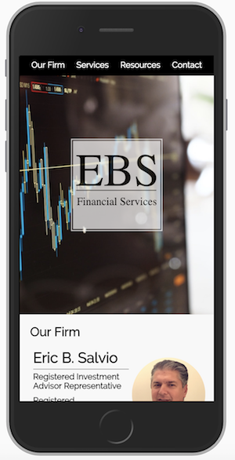

# EBS Financial Services
- This was a very interesting project to build. I was able to experience what it is like to interact with a client that has specific needs for a website. The styling and logos were my creations, but the overall purpose of the site had stricter parameters.

-Technologies: HTML, CSS, Vanilla JS, EmailJS API
## Landing

- The first thing a customer would see. I chose a sticky Nav bar to make it easier for users to navigate the site.

## Services

- A list of expanding divs. When expanded, the divs display a few paragraph outlining each service and how the company can assist its customers.
  - I have not yet added the CSS animations for the expanding and contracting of the divs.
## Resources

- Another list of expanding divs. Expanded, they show links to outsite websites that clients can access.
## Form

- A contact form, when submitted, data is sent through the EmailJS API into an email for the company.
